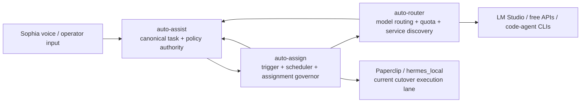
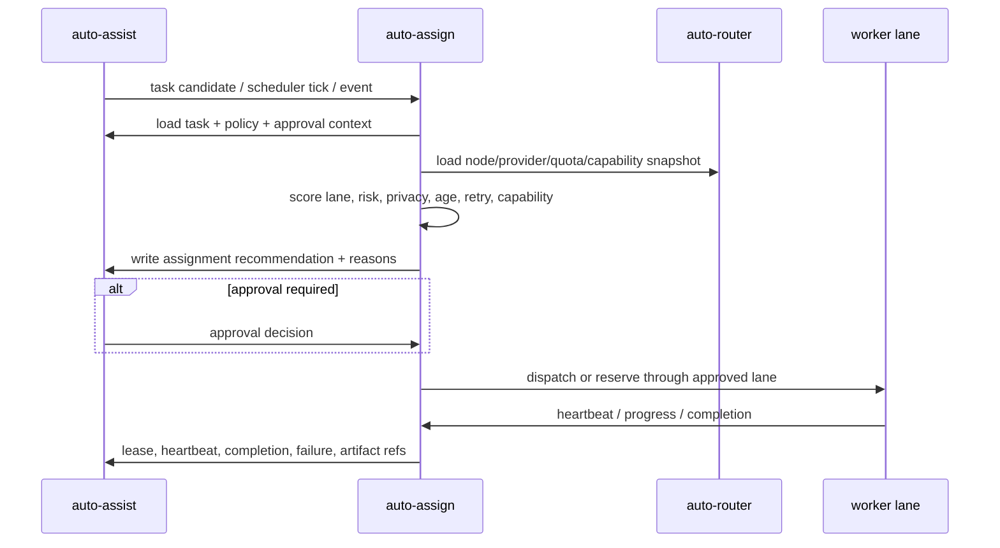

# auto-assign

`auto-assign` is the assignment, trigger, and heartbeat service for the AssistX homelab agent stack.

It is intended to sit between `auto-assist` and `auto-router` and answer the operational question:

> What work is eligible to run next, why should it go to a specific lane/node/model, what approval is required, and how do we know the assigned worker is still alive?

This repo should not become a second task database, a model router, or a repo-mutating executor. Its purpose is to evaluate work, produce explainable assignment decisions, track leases/heartbeats, and write assignment provenance back to AssistX.

## System role

### Responsibilities

`auto-assign` owns:

- scheduler ticks and backlog trigger evaluation;
- worker/node heartbeat ingestion;
- assignment scoring and explainable routing recommendations;
- task lease awareness and stale assignment release;
- approval gating before any higher-risk work is dispatched;
- coordination between AssistX task state and router capability/quota data;
- idempotent assignment events back to AssistX/Neo4j.

`auto-assign` does **not** own:

- canonical task state: owned by `auto-assist`;
- raw voice/Sophia enrollment or auth records: owned by `auto-assist`;
- provider/model request routing: owned by `auto-router`;
- quota reservation internals: owned by `auto-router`;
- code mutation, commit, push, or shell execution: future worker adapters only, gated by approval/sandbox policy;
- prompt/response body history: should not be persisted by default.

## Integration boundaries

| System | Role | `auto-assign` integration |
|---|---|---|
| [`auto-assist`](https://github.com/scottjoyner/auto-assist) | Canonical task, policy, Sophia, Paperclip dispatch, graph authority | Read eligible tasks and policy context; write assignment decisions, lease transitions, trigger outcomes, and heartbeat summaries back as events. |
| [`auto-router`](https://github.com/scottjoyner/auto-router) | OpenAI-compatible router, quota manager, service/model/CLI discovery, route provenance | Query route/capability/quota summaries; request dry-run plans for assignment scoring; never bypass privacy/local-only rules. |
| Paperclip / `hermes_local` | Current cutover execution path | Treat as the supported execution lane until direct worker claiming is explicitly promoted. |
| Future direct workers | Deferred execution lanes | Use only after approval, sandboxing, leases, and write-back contracts are implemented. |

## Operating model

## Documentation

- [`docs/HLD.md`](docs/HLD.md) — high-level architecture, system context, trigger/heartbeat role, and integration boundaries.
- [`docs/LLD.md`](docs/LLD.md) — low-level modules, API contracts, event payloads, scoring model, persistence model, and sequence flows.
- [`docs/IMPLEMENTATION_PLAN.md`](docs/IMPLEMENTATION_PLAN.md) — prioritized implementation plan for the next cycle.

## Proposed API surface

Initial service endpoints should be private-network/Tailscale only:

| Method | Path | Purpose |
|---|---|---|
| `GET` | `/health` | Service, dependency, and scheduler health. |
| `POST` | `/api/scheduler/tick` | Manually run one assignment evaluation cycle. |
| `POST` | `/api/events` | Accept AssistX/router events using a signed event envelope. |
| `POST` | `/api/heartbeats` | Record node/worker heartbeat payloads. |
| `POST` | `/api/assignments/evaluate` | Evaluate one task or candidate batch without dispatching. |
| `GET` | `/api/assignments` | List recent recommendations, decisions, and lease status. |
| `POST` | `/api/assignments/{assignment_id}/approve` | Approve a gated assignment. |
| `POST` | `/api/assignments/{assignment_id}/release` | Release an expired or blocked assignment. |

## First implementation targets

1. Bootstrap a FastAPI service with `health`, `scheduler/tick`, and `assignments/evaluate`.
2. Add AssistX client for read-only candidate intake and event write-back.
3. Add router client for context/quota/capability snapshots.
4. Add a deterministic assignment scorer with explainable skip/select reasons.
5. Add SQLite local cache/outbox so assignment events survive AssistX downtime.
6. Add lease and heartbeat state transitions.
7. Keep execution dispatch disabled by default until approval and sandbox controls are present.

## Safety defaults

- Private network only by default.
- Local-only and sensitive work must stay local.
- Unknown speaker or non-Scott-originated work requires approval.
- No repo write/commit/push without explicit operator approval.
- No secrets, raw prompts, voiceprints, or enrollment samples in assignment events.
- All write-back events must be idempotent.
