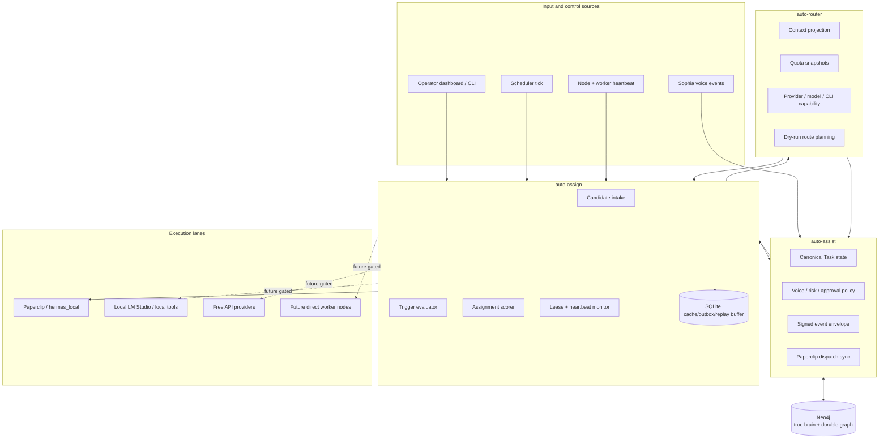
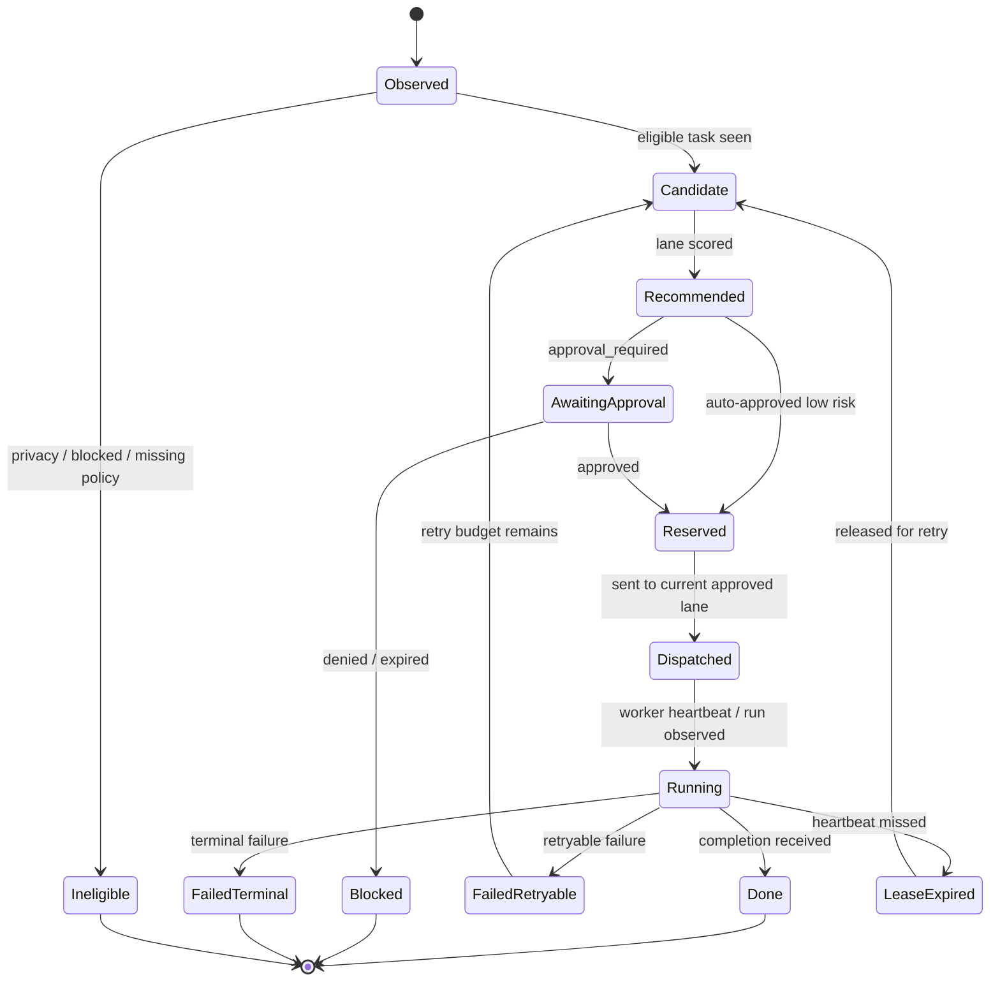
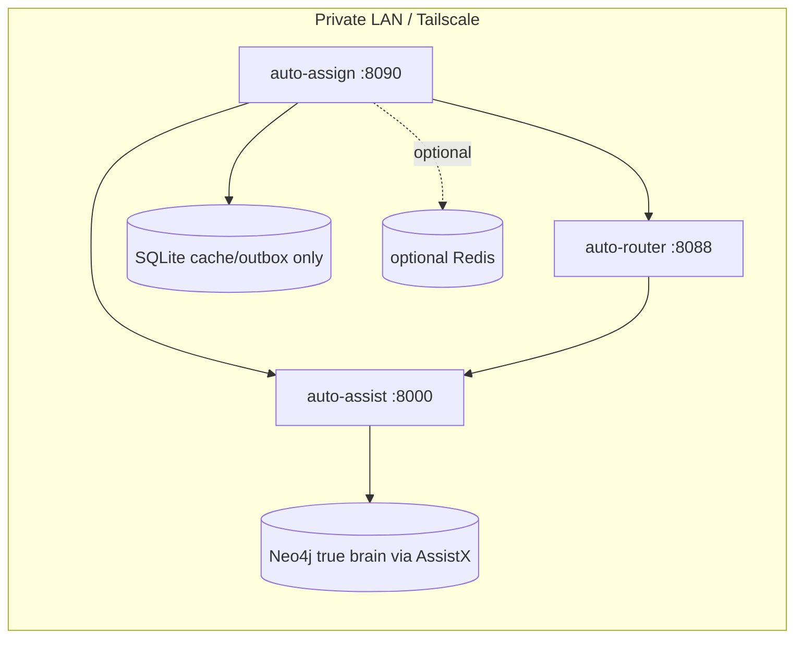

# High-Level Design: auto-assign

## 1. Executive summary

`auto-assign` is the trigger, scheduler, assignment, and heartbeat layer for the AssistX agent ecosystem.

It should evaluate eligible work from `auto-assist`, combine that work with node/model/quota/capability context from `auto-router`, and produce an explainable assignment decision. It does not own canonical task state and does not directly replace the current Paperclip cutover path.

The system exists because the stack needs a clear layer that understands **why** work should run, **where** it should run, **when** it should wait, **what approval is needed**, and **whether the assigned lane is still alive**.

Neo4j is the true brain for this ecosystem. `auto-assign` can use SQLite only as a local cache, outbox, replay buffer, and dependency mirror. SQLite must never become the durable assignment brain or task authority.

## 2. Design goals

1. Keep `auto-assist` plus Neo4j as the task-state, policy, memory, and provenance authority.
2. Keep `auto-router` as the model/provider/quota routing authority.
3. Make assignment decisions deterministic, explainable, and auditable.
4. Prevent duplicate dispatches through idempotency keys and leases.
5. Treat scheduler ticks and heartbeats as first-class control-plane events.
6. Preserve the current Paperclip / `hermes_local` execution lane until direct workers are explicitly promoted.
7. Keep sensitive, local-only, and voice-auth/enrollment data out of cloud and out of assignment event bodies.
8. Support future direct worker lanes without re-architecting the graph/event model.
9. Ensure every meaningful assignment fact is replayed into Neo4j through AssistX events.

## 3. Non-goals

`auto-assign` should not:

- store canonical tasks as the source of truth;
- store canonical assignments as the source of truth;
- use SQLite as durable system memory;
- perform raw model routing or quota reservation internally;
- mutate repos or external systems directly;
- bypass AssistX approval requirements;
- store raw prompts, response bodies, voiceprints, enrollment samples, or secrets;
- scrape arbitrary services outside the private network;
- introduce a second execution authority before the current cutover path is stable.

## 4. System context



## 5. Data ownership

| Data / decision | Owner | `auto-assign` behavior |
|---|---|---|
| Task lifecycle | `auto-assist` + Neo4j | Reads candidates; writes assignment/lease/progress events back. |
| Sophia voice/auth policy | `auto-assist` + Neo4j | Consumes policy decisions; never stores voiceprints or enrollment samples. |
| Assignment decision history | Neo4j through AssistX events | Produces decisions and reasons; local cache is only a replay/outbox mirror. |
| Paperclip cutover dispatch | `auto-assist` / Paperclip | Treats Paperclip as supported execution lane until replacement is approved. |
| Model/provider routing | `auto-router` | Uses route dry-runs and capability/quota snapshots; does not choose concrete model providers alone. |
| Quota counters/reservations | `auto-router` | Reads summaries and respects reserves; does not directly spend quota. |
| Assignment recommendation computation | `auto-assign` | Owns score, selected lane, skip reasons, idempotency, and lease proposal. |
| Local SQLite cache/outbox | `auto-assign` | Durable local recovery and replay only; safe to delete and rebuild. |
| Artifacts | AssistX/Paperclip/NAS later | Stores references only. |

## 6. Assignment lifecycle



The lifecycle is computed locally for scheduling, but the canonical lifecycle facts must be written to Neo4j through AssistX. If local cache and Neo4j disagree, Neo4j wins.

## 7. Trigger and heartbeat model

`auto-assign` should react to four trigger classes:

| Trigger | Source | Purpose |
|---|---|---|
| `scheduler.tick` | cron/systemd/operator/API | Periodically evaluate eligible backlog. |
| `task.candidate.created` | AssistX event sink | Evaluate a newly eligible task immediately. |
| `worker.heartbeat` | node/worker/Paperclip/router | Refresh availability and detect stale assignments. |
| `quota.snapshot.changed` | auto-router event or poll | Re-score backlog when free quota, local models, or circuits change. |

Heartbeats should affect assignment state but should not alone authorize execution. A node can be online while still blocked by policy, privacy, capability, quota, or approval state.

## 8. Assignment scoring model

The scorer should produce a ranked decision with explicit reasons.

Inputs:

- AssistX/Neo4j task priority, age, retry count, risk level, approval state, privacy labels, and required capabilities;
- current Paperclip availability and cutover status;
- router context projection for nodes, providers, local LM Studio endpoints, free API lanes, and code-agent CLIs;
- quota summaries and reserve mode;
- heartbeat freshness;
- local-only and sensitivity flags;
- operator policy overrides.

Candidate lane categories:

| Lane | Description | Default posture |
|---|---|---|
| `paperclip` | Current supported non-realtime execution path through Paperclip / `hermes_local`. | Preferred for execution cutover. |
| `router_model` | LLM request routed through `auto-router`. | Allowed for planning/drafting when privacy/quota policy permits. |
| `local_only` | Local LM Studio or local tools. | Required for sensitive/private work. |
| `free_api` | Hosted free quota providers. | Allowed only for non-sensitive work and after reserve checks. |
| `direct_worker` | Direct Hermes worker nodes such as xwing. | Candidate lane for dry-run scoring now; execution remains disabled until sandbox/approval/lease flow is complete. |
| `blocked` | No safe route available. | Emits skip reason. |

Example score components:

| Component | Meaning |
|---|---|
| `policy_fit` | Does policy allow this lane? |
| `capability_fit` | Does lane support required tools/model/task type? |
| `privacy_fit` | Can data leave local boundary? |
| `availability_fit` | Are node/service heartbeats fresh? |
| `quota_fit` | Is quota available without violating reserve? |
| `risk_fit` | Does task require approval or sandboxing? |
| `staleness_boost` | Older safe backlog gets priority. |
| `retry_penalty` | Repeated failures lower priority or force review. |

## 9. Event architecture

All cross-service mutation should happen through idempotent events. `auto-assign` can cache pending events locally, but AssistX/Neo4j remains the graph write target and system of record.

Recommended event types:

| Event type | Meaning |
|---|---|
| `assign.scheduler.tick.started` | A scheduler pass began. |
| `assign.scheduler.tick.completed` | A scheduler pass ended with counts and decisions. |
| `assign.assignment.recommended` | A task was scored and a lane was recommended. |
| `assign.assignment.skipped` | A task was skipped with explicit reason. |
| `assign.assignment.approval_required` | A decision needs operator approval. |
| `assign.assignment.reserved` | A lane was reserved/leased for work. |
| `assign.assignment.dispatched` | Work was handed to an approved lane. |
| `assign.assignment.heartbeat` | Progress or liveness observed for an assignment. |
| `assign.assignment.released` | Assignment lease expired or was manually released. |
| `assign.assignment.completed` | Work reached terminal success. |
| `assign.assignment.failed` | Work failed with retryable/terminal classification. |
| `assign.worker.heartbeat.recorded` | Node or worker heartbeat was accepted. |

## 10. Neo4j graph model

`auto-assign` should emit events that AssistX can materialize into graph relationships like:

```text
(Task)-[:HAS_ASSIGNMENT_DECISION]->(AssignmentDecision)
(AssignmentDecision)-[:HAS_REASON]->(AssignmentReason)
(AssignmentDecision)-[:CREATED_LEASE]->(AssignmentLease)
(AssignmentLease)-[:HEARTBEAT]->(WorkerHeartbeat)
(AssignmentDecision)-[:USED_ROUTER_CONTEXT]->(RouterContextProjection)
(AssignmentDecision)-[:USED_ROUTER_DECISION]->(RouterDecision)
(AssignmentDecision)-[:TARGETED]->(SwarmNode|RouterProvider|PaperclipAdapter|AgentWorker)
(AssignmentDecision)-[:PRODUCED_RUN]->(AgentRun)
(AgentRun)-[:PRODUCED]->(Artifact)
```

Exact labels can evolve, but durable relationship preservation belongs in Neo4j, not SQLite.

## 11. Deployment posture



Recommended defaults:

- expose only on private LAN/Tailscale;
- require signed event envelopes or shared internal auth;
- use SQLite only for cache/outbox/replay buffering;
- reconcile cache against AssistX/Neo4j on startup;
- keep dispatch disabled in development mode;
- poll AssistX/router with backoff;
- do not log prompt bodies or secrets;
- provide a dry-run mode for every scheduler action.

## 12. Key risks and mitigations

| Risk | Mitigation |
|---|---|
| Duplicate task dispatch | Idempotency keys, AssistX task links, assignment leases, and terminal-state checks. |
| Competing task authority | Treat local DB as cache/outbox only; write canonical events to AssistX/Neo4j. |
| SQLite becoming hidden brain | Make cache safe to delete, reconcile on startup, and ensure Neo4j wins conflicts. |
| Privacy leak to cloud providers | Enforce local-only/privacy labels before router dry-run or provider selection. |
| Quota starvation for Sophia realtime | Respect router reserve mode and do not burn critical reserves. |
| Stale worker holds assignment | Lease expiration and heartbeat monitor. |
| Repo mutation without approval | Direct worker lane disabled by default; explicit approval required for write/commit/push. |
| Prompt/secret persistence | Store metadata, hashes, and refs only. |

## 13. MVP scope

The first implementation cycle should deliver:

1. FastAPI service shell and health endpoint.
2. AssistX client for task candidate intake, graph-state reconciliation, and event write-back.
3. Router client for context/quota/capability snapshots.
4. Scheduler tick endpoint with dry-run mode.
5. Assignment scorer with skip/select reasons.
6. Local SQLite cache/outbox/replay tables for pending events, dedupe, scheduler summaries, and dependency mirrors only.
7. Startup reconciliation where AssistX/Neo4j wins conflicts.
8. Heartbeat ingestion and stale lease release logic.
9. README, HLD, LLD, Neo4j cache policy, and implementation plan.
