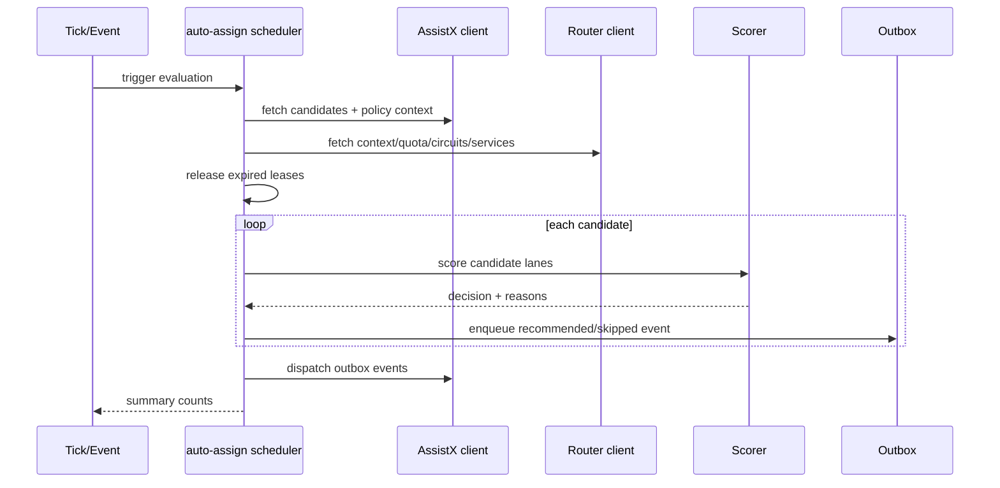
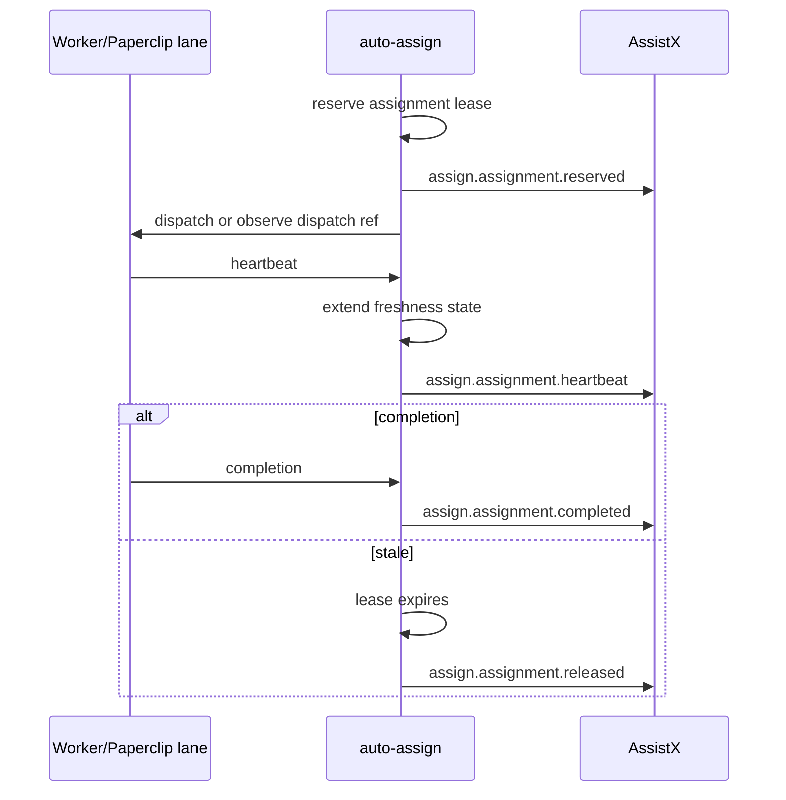

# Low-Level Design: auto-assign

## 1. Purpose

This low-level design maps the `auto-assign` role to concrete modules, APIs, local persistence, event payloads, scoring logic, and integration contracts.

`auto-assign` is the assignment control plane. It evaluates tasks from AssistX, reads router capability/quota context, produces assignment decisions, monitors heartbeats, and writes idempotent events back to AssistX.

## 2. Proposed application layout

```text
.
├── src/auto_assign/
│   ├── __init__.py
│   ├── main.py                  # FastAPI app entrypoint
│   ├── settings.py              # env/config loading
│   ├── models.py                # Pydantic request/event/domain models
│   ├── assistx_client.py        # AssistX task/policy/event client
│   ├── router_client.py         # auto-router context/quota/dry-run client
│   ├── scheduler.py             # scheduler tick orchestration
│   ├── scorer.py                # deterministic assignment scoring
│   ├── leases.py                # lease expiration and release logic
│   ├── heartbeats.py            # worker/node heartbeat logic
│   ├── policy.py                # approval/privacy/risk gate helpers
│   ├── outbox.py                # durable event outbox
│   ├── store.py                 # SQLite persistence
│   └── api/
│       ├── health.py
│       ├── events.py
│       ├── scheduler.py
│       ├── assignments.py
│       └── heartbeats.py
├── docs/
│   ├── HLD.md
│   ├── LLD.md
│   └── IMPLEMENTATION_PLAN.md
├── tests/
├── pyproject.toml
├── .env.example
└── README.md
```

## 3. Runtime configuration

| Environment variable | Purpose | Default |
|---|---|---|
| `AUTO_ASSIGN_HOST` | Bind host | `0.0.0.0` |
| `AUTO_ASSIGN_PORT` | Bind port | `8090` |
| `AUTO_ASSIGN_DATABASE_URL` | SQLite DB path/URL | `sqlite:///./data/auto_assign.sqlite3` |
| `AUTO_ASSIGN_ASSISTX_BASE_URL` | AssistX API base URL | `http://assistx:8000` |
| `AUTO_ASSIGN_ROUTER_BASE_URL` | auto-router API base URL | `http://auto-router:8088` |
| `AUTO_ASSIGN_EVENT_SHARED_SECRET` | Shared secret for signed internal events | unset/dev only |
| `AUTO_ASSIGN_SCHEDULER_ENABLED` | Enable background scheduler | `false` |
| `AUTO_ASSIGN_TICK_INTERVAL_SECONDS` | Background tick cadence | `300` |
| `AUTO_ASSIGN_DEFAULT_LEASE_SECONDS` | Default assignment lease | `900` |
| `AUTO_ASSIGN_STALE_HEARTBEAT_SECONDS` | Heartbeat freshness window | `120` |
| `AUTO_ASSIGN_DISPATCH_ENABLED` | Permit actual dispatch | `false` |
| `AUTO_ASSIGN_DIRECT_WORKERS_ENABLED` | Permit direct-worker lane | `false` |
| `AUTO_ASSIGN_LOG_PAYLOAD_BODIES` | Log prompt/task body payloads | `false` |

## 4. API surface

All endpoints should be private-network/Tailscale only and protected by shared internal auth or signed event envelopes.

### 4.1 Health

```text
GET /health
```

Response shape:

```json
{
  "status": "ok",
  "service": "auto-assign",
  "version": "0.1.0",
  "assistx": {"reachable": true, "latency_ms": 12},
  "router": {"reachable": true, "latency_ms": 9},
  "store": {"reachable": true},
  "scheduler": {"enabled": false, "last_tick_at": null}
}
```

### 4.2 Event intake

```text
POST /api/events
```

Accepts AssistX/router-compatible event envelopes.

Required event envelope fields:

| Field | Description |
|---|---|
| `event_id` | Globally unique event ID. |
| `event_type` | Event type string. |
| `source_service` | `auto-assist`, `auto-router`, `auto-assign`, etc. |
| `occurred_at` | Unix timestamp or RFC3339 datetime. |
| `idempotency_key` | Stable dedupe key. |
| `schema_version` | Event schema version. |
| `subject` | Primary object reference. |
| `payload` | Event-specific metadata; no secrets or raw prompts. |
| `privacy` | Optional privacy labels. |

Handled inbound events:

| Event type | Action |
|---|---|
| `task.candidate.created` | Evaluate one task candidate. |
| `task.state.changed` | Reconcile assignment state. |
| `router.quota_snapshot.recorded` | Refresh quota view and optionally re-score. |
| `router.service_snapshot.recorded` | Refresh service availability view. |
| `router.agent_cli.discovered` | Refresh worker capability view. |
| `assign.worker.heartbeat.recorded` | Record heartbeat if sent through AssistX. |

### 4.3 Scheduler tick

```text
POST /api/scheduler/tick
```

Request:

```json
{
  "dry_run": true,
  "limit": 25,
  "reason": "manual_operator_tick",
  "include_blocked": false,
  "task_ids": []
}
```

Response:

```json
{
  "scheduler_run_id": "tick_20260530_001",
  "dry_run": true,
  "evaluated": 12,
  "recommended": 3,
  "approval_required": 2,
  "skipped": 7,
  "released_expired": 1,
  "decisions": []
}
```

### 4.4 Assignment evaluation

```text
POST /api/assignments/evaluate
```

Request:

```json
{
  "task_id": "ASS-28",
  "dry_run": true,
  "force_refresh_context": true,
  "candidate_lanes": ["paperclip", "router_model", "local_only", "free_api"]
}
```

Response:

```json
{
  "assignment_id": "assign_ASS-28_001",
  "task_id": "ASS-28",
  "status": "recommended",
  "selected_lane": "paperclip",
  "selected_target": "hermes_local",
  "approval_required": false,
  "score": 0.87,
  "reasons": [
    "paperclip is current approved cutover lane",
    "task is non-sensitive",
    "worker heartbeat is fresh"
  ],
  "skipped_lanes": [
    {"lane": "free_api", "reason": "not needed; cutover lane available"},
    {"lane": "direct_worker", "reason": "direct workers disabled"}
  ]
}
```

### 4.5 Assignment list and detail

```text
GET /api/assignments
GET /api/assignments/{assignment_id}
```

Filters:

| Query param | Meaning |
|---|---|
| `status` | `recommended`, `approval_required`, `reserved`, `dispatched`, `running`, `done`, `failed`, `blocked`, `released` |
| `task_id` | Filter by task. |
| `lane` | Filter by selected lane. |
| `limit` | Max rows. |

### 4.6 Approval and release

```text
POST /api/assignments/{assignment_id}/approve
POST /api/assignments/{assignment_id}/release
```

Approve request:

```json
{
  "approved_by": "operator",
  "approval_reason": "safe low-risk repo documentation task",
  "expires_in_seconds": 900
}
```

Release request:

```json
{
  "reason": "lease_expired",
  "retryable": true
}
```

### 4.7 Heartbeats

```text
POST /api/heartbeats
```

Request:

```json
{
  "node_id": "x1-370",
  "worker_id": "paperclip-hermes-local",
  "assignment_id": "assign_ASS-28_001",
  "status": "running",
  "capabilities": ["chat", "code", "local_model"],
  "services": [
    {"service_id": "x1.lmstudio", "status": "online", "url": "http://x1-370:1234/v1"}
  ],
  "metrics": {
    "cpu_load": 0.42,
    "gpu_available": true,
    "active_jobs": 1
  }
}
```

## 5. Core domain models

### 5.1 AssignmentCandidate

| Field | Meaning |
|---|---|
| `task_id` | AssistX task ID. |
| `source_event_id` | Event that caused evaluation. |
| `priority` | AssistX task priority. |
| `risk_level` | `low`, `medium`, `high`. |
| `approval_required` | Policy-derived approval gate. |
| `privacy_labels` | `local_only`, `private_data`, `voice_auth`, etc. |
| `required_capabilities` | Required worker/model/tool capabilities. |
| `allowed_lanes` | Policy-allowed assignment lanes. |
| `retry_count` | Current retry count. |
| `created_at` | Task creation time. |

### 5.2 RouterSnapshot

| Field | Meaning |
|---|---|
| `context_revision` | Router context revision. |
| `nodes` | Known nodes and heartbeat status. |
| `providers` | Provider lanes, blocked status, capabilities. |
| `services` | Service registry status. |
| `quota` | Quota snapshot/reserve mode summary. |
| `circuits` | Open/degraded provider circuit state. |

### 5.3 AssignmentDecision

| Field | Meaning |
|---|---|
| `assignment_id` | Stable assignment ID. |
| `task_id` | AssistX task ID. |
| `decision_id` | Stable scoring decision ID. |
| `selected_lane` | Chosen lane. |
| `selected_target` | Worker/provider/model/service target. |
| `status` | Recommendation/lease/dispatch state. |
| `score` | Normalized decision score. |
| `approval_required` | Whether dispatch must wait. |
| `lease_expires_at` | Lease expiration, if reserved. |
| `reasons` | Human-readable select reasons. |
| `skip_reasons` | Per-lane skip reasons. |
| `context_revision` | Router/AssistX context revision used. |
| `idempotency_key` | Stable write-back key. |

## 6. Local SQLite persistence

Local DB is cache/outbox only. AssistX remains canonical.

### 6.1 `scheduler_runs`

| Column | Type | Notes |
|---|---|---|
| `scheduler_run_id` | text pk | Stable run ID. |
| `started_at` | datetime | Start time. |
| `completed_at` | datetime nullable | End time. |
| `trigger_reason` | text | Manual, interval, event, quota change. |
| `dry_run` | boolean | Whether dispatch was disabled. |
| `evaluated_count` | integer | Candidate count. |
| `recommended_count` | integer | Recommendations. |
| `skipped_count` | integer | Skips. |
| `error_summary` | text nullable | Failure summary. |

### 6.2 `assignments`

| Column | Type | Notes |
|---|---|---|
| `assignment_id` | text pk | Stable assignment ID. |
| `task_id` | text indexed | AssistX task ID. |
| `decision_id` | text indexed | Scoring decision ID. |
| `status` | text indexed | Lifecycle state. |
| `selected_lane` | text | Lane. |
| `selected_target` | text | Worker/provider target. |
| `score` | real | Normalized score. |
| `approval_required` | boolean | Approval gate. |
| `lease_expires_at` | datetime nullable | Lease expiration. |
| `context_revision` | text nullable | Context used. |
| `idempotency_key` | text unique | Dedupe key. |
| `created_at` | datetime | Created time. |
| `updated_at` | datetime | Updated time. |

### 6.3 `assignment_reasons`

| Column | Type | Notes |
|---|---|---|
| `id` | integer pk | Row ID. |
| `assignment_id` | text indexed | Assignment. |
| `reason_type` | text | `select`, `skip`, `risk`, `privacy`, `quota`, `capability`, `approval`. |
| `lane` | text nullable | Related lane. |
| `reason` | text | Human-readable reason. |
| `weight` | real nullable | Score contribution. |

### 6.4 `heartbeats`

| Column | Type | Notes |
|---|---|---|
| `heartbeat_id` | text pk | Stable heartbeat ID. |
| `node_id` | text indexed | Node. |
| `worker_id` | text indexed nullable | Worker. |
| `assignment_id` | text indexed nullable | Assignment. |
| `status` | text | Online/running/degraded/offline. |
| `received_at` | datetime | Server time. |
| `payload_json` | text | Metadata without secrets. |

### 6.5 `outbox_events`

| Column | Type | Notes |
|---|---|---|
| `event_id` | text pk | Event ID. |
| `event_type` | text indexed | Event type. |
| `idempotency_key` | text unique | Dedupe key. |
| `subject` | text | Subject reference. |
| `payload_json` | text | Event payload. |
| `status` | text indexed | `pending`, `delivered`, `failed`, `dead_letter`. |
| `attempts` | integer | Dispatch attempts. |
| `next_attempt_at` | datetime nullable | Retry schedule. |
| `last_error` | text nullable | Failure reason. |
| `created_at` | datetime | Created. |
| `updated_at` | datetime | Updated. |

## 7. Scoring algorithm

### 7.1 Hard gates

A candidate lane is immediately skipped when:

- task is `local_only` and lane would use cloud;
- approval is required and no approval exists;
- direct worker lane is disabled;
- lane lacks required capabilities;
- worker heartbeat is stale;
- router marks provider/service as blocked;
- quota reserve mode would starve critical/Sophia capacity;
- task is terminal in AssistX;
- idempotency check shows an active assignment already exists.

### 7.2 Score components

```text
score =
  policy_fit        * 0.25 +
  capability_fit    * 0.20 +
  privacy_fit       * 0.20 +
  availability_fit  * 0.15 +
  quota_fit         * 0.10 +
  age_priority_fit  * 0.05 +
  retry_fit         * 0.05
```

The exact weights should be config-driven later, but deterministic defaults are useful for MVP testing.

### 7.3 Preferred lane order

Initial default preference:

1. `paperclip` for current cutover execution tasks.
2. `local_only` for sensitive/private tasks that can run locally.
3. `router_model` for planning/drafting/review tasks.
4. `free_api` for non-sensitive backlog burn-down when quota is surplus.
5. `direct_worker` only after sandbox and approval controls are complete.
6. `blocked` when no safe lane exists.

## 8. AssistX client contract

### 8.1 Read candidates

Preferred endpoint:

```text
GET /api/router/backlog-candidates?limit=25
```

Expected candidate fields:

| Field | Meaning |
|---|---|
| `task_id` | AssistX task ID. |
| `status` | Current task status. |
| `priority` | Task priority. |
| `risk_level` | Risk classification. |
| `approval_required` | Whether approval is needed. |
| `privacy_labels` | Local/privacy labels. |
| `required_capabilities` | Capabilities needed. |
| `retry_count` | Retry count. |
| `created_at` | Created timestamp. |
| `summary` | Safe summary, not raw prompt if sensitive. |

### 8.2 Write events

Preferred endpoint:

```text
POST /api/events
```

`auto-assign` should use the same envelope style as AssistX/router event contracts and include stable idempotency keys.

## 9. auto-router client contract

Useful endpoints:

| Endpoint | Purpose |
|---|---|
| `GET /health` | Router health and context status. |
| `GET /admin/context` | Node/provider/service context projection. |
| `GET /admin/quota` | Quota snapshots and reserve visibility. |
| `GET /admin/circuits` | Provider circuit state. |
| `POST /admin/backlog/dry-run` | Optional route dry-run / selection preview. |
| `GET /admin/agent-clis` | Discovered local code-agent CLIs. |
| `GET /admin/services` | Service registry and latest scan status. |

`auto-assign` must treat router data as advisory unless the endpoint explicitly returns a hard block. The router owns quota internals and concrete model/provider routing.

## 10. Event payloads emitted by auto-assign

### 10.1 `assign.assignment.recommended`

```json
{
  "assignment_id": "assign_ASS-28_001",
  "task_id": "ASS-28",
  "decision_id": "decision_ASS-28_001",
  "selected_lane": "paperclip",
  "selected_target": "hermes_local",
  "score": 0.87,
  "approval_required": false,
  "reasons": ["paperclip is current approved cutover lane"],
  "skipped_lanes": [
    {"lane": "direct_worker", "reason": "direct workers disabled"}
  ],
  "context_revision": "router-rev-123",
  "dry_run": true
}
```

### 10.2 `assign.assignment.dispatched`

```json
{
  "assignment_id": "assign_ASS-28_001",
  "task_id": "ASS-28",
  "lane": "paperclip",
  "target": "hermes_local",
  "lease_expires_at": "2026-05-30T15:15:00Z",
  "dispatch_ref": "paperclip:ASS-28"
}
```

### 10.3 `assign.assignment.skipped`

```json
{
  "task_id": "ASS-29",
  "reason_code": "approval_required",
  "reason": "non-Scott or high-risk task requires approval before dispatch",
  "candidate_lanes": ["paperclip", "router_model"],
  "context_revision": "router-rev-123"
}
```

### 10.4 `assign.worker.heartbeat.recorded`

```json
{
  "node_id": "x1-370",
  "worker_id": "paperclip-hermes-local",
  "assignment_id": "assign_ASS-28_001",
  "status": "running",
  "received_at": "2026-05-30T15:02:00Z",
  "capabilities": ["chat", "code", "local_model"],
  "service_status": [
    {"service_id": "x1.lmstudio", "status": "online"}
  ]
}
```

## 11. Scheduler sequence



## 12. Lease and heartbeat sequence



## 13. Testing strategy

Minimum unit/integration tests:

| Test area | Required checks |
|---|---|
| Scoring | Lane selected with correct reasons for paperclip, local-only, free API, blocked, approval-required. |
| Privacy | Cloud/free API skipped for local-only/private/voice-auth work. |
| Idempotency | Same task/event does not create duplicate active assignments. |
| Leases | Expired lease releases assignment and emits event. |
| Heartbeats | Fresh heartbeat updates status; stale heartbeat triggers release path. |
| Router client | Handles router unavailable; falls back to conservative blocked/degraded context. |
| AssistX client | Retries event write-back and uses idempotency keys. |
| Outbox | Pending/delivered/dead-letter transitions. |
| API | Scheduler dry-run does not dispatch. |

## 14. Security requirements

- Bind to private network or localhost unless explicitly configured.
- Require signed events for inbound mutation.
- Never log or persist secrets, `.env` values, voiceprints, enrollment samples, raw prompts, or response bodies.
- Sanitize task summaries before writing events.
- Treat cloud/free API lanes as disallowed unless privacy labels permit them.
- Keep dispatch disabled by default.
- Keep direct workers disabled by default.
- Require approval before repo writes, commits, pushes, production mutations, financial actions, or legal actions.

## 15. Acceptance criteria for MVP

MVP is complete when:

1. `GET /health` reports AssistX/router/store status.
2. `POST /api/scheduler/tick` can dry-run against mock or real AssistX candidates.
3. `POST /api/assignments/evaluate` returns deterministic select/skip reasons.
4. Assignment events are stored in local outbox with idempotency keys.
5. Outbox can dispatch to AssistX or run in dry-run mode.
6. Heartbeats can be recorded and stale leases can be released.
7. Tests prove local-only/privacy/approval gates block unsafe lanes.
